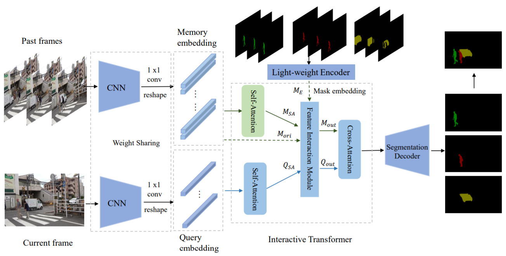

# Siamese Network with Interactive Transformer for Video Object Segmentation

This repository is the code release of the paper [Siamese Network with Interactive Transformer for Video Object Segmentation](https://arxiv.org/abs/2112.13983), accepted by AAAI 2022.

<p align="center">
  
</p>

## Requirements
- Linux
- Python >= 3.6
- Pytorch >=1.5
- CUDA>=9.0
- Pillow, opencv-python, scipy


## Training

#### Stage 1
Pretraining on MS-COCO.
```
python train_coco.py -Dcoco "path to coco" 
```

#### Stage 2
Training on Davis & Youtube-VOS.
```
python train_davis.py -Ddavis "path to davis" -Dyoutube "path to youtube-vos" -resume "path to coco pretrained weights"
```

## Evaluation
Evaluating on DAVIS  val set.
```
python eval.py -p "path to weights"
```
## Demo


## Acknowledgement
This codebase borrows the code and structure from [official STM repository](https://github.com/seoungwugoh/STM)
## Citing SITVOS
```
@article{lan2021siamese,
  title={Siamese Network with Interactive Transformer for Video Object Segmentation},
  author={Lan, Meng and Zhang, Jing and He, Fengxiang and Zhang, Lefei},
  journal={arXiv preprint arXiv:2112.13983},
  year={2021}
}
```

